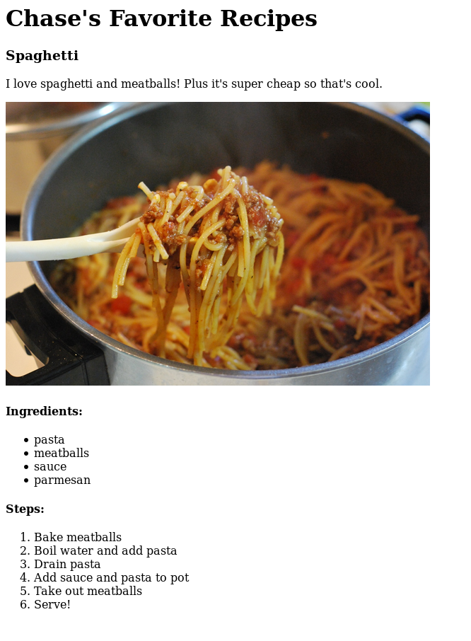

# Lesson 2: Basic HTML and Developer Tools

In this assignment, we will learn how to use some of the most common HTML elements and we will take a look at one of the web developer's most useful resources: the developer tools.

## Developer Tools

The best developers know how to work well with tools, and the **best** tool for web developers is what's called **[Browser Developer Tools](https://developer.mozilla.org/en-US/docs/Learn/Common_questions/What_are_browser_developer_tools)**. Developers typically use either Firefox or Chrome when they are working, and each of those browsers have their own developer tools but they are 90% the same. You can open the dev tools in Firefox by right clicking on a webpage then clicking "Inspect Element", and in Chrome by right clicking on a webpage then clicking "Inspect". This [video](https://www.youtube.com/watch?v=x4q86IjJFag) goes into depth explaining dev tools and showing some of the cool useful features.

In this assignment we will use the inspector in the dev tools to go on a treasure hunt on a webpage.

### To Do

You are an undercover cyber FBI agent and have been given access to a hacker's personal online diary. If you look close enough you might be able to uncover some confidential information. Inspect [this](https://goofy-neumann-f8ebc4.netlify.com/) page for clues and file your report [here](https://forms.gle/Cy8f8ZHAVgVBmSxJA).

## HTML

Let's create a web page for some of your favorite recipes! Your page can look however you want but it must have at least one of the following elements:

- `title` for the web page title
- `h1` for the page title
- `h2` (or h3) for each recipe title
- `img` for food picture
- `p` for recipe description
- `ul` for list of ingredients
- `ol` for recipe steps

Here's an example to go off of. We'll build on this page to make it look cooler in the future, but feel free to make it your own!

### To Do

Create a GitHub repo called `recipes`. Add at least three recipes using the required HTML elements. Configure GitHub pages to watch the master branch.
